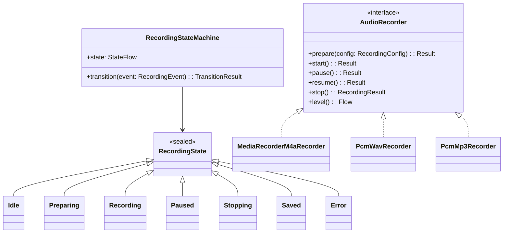

# C4 — Nível 4: Código (recorte)

Contrato da estratégia de gravação e da máquina de estados.

```mermaid
classDiagram
    class AudioRecorder {
        <<interface>>
        +prepare(config: RecordingConfig): Result<Unit>
        +start(): Result<Unit>
        +pause(): Result<Unit>
        +resume(): Result<Unit>
        +stop(): RecordingResult
        +level(): Flow<Float>
    }
    class RecordingStateMachine {
        +state: StateFlow<RecordingState>
        +transition(event: RecordingEvent): TransitionResult
    }
    class RecordingState {
        <<sealed>>
    }
    class Idle
    class Preparing
    class Recording
    class Paused
    class Stopping
    class Saved
    class Error

    AudioRecorder <|.. MediaRecorderM4aRecorder
    AudioRecorder <|.. PcmWavRecorder
    AudioRecorder <|.. PcmMp3Recorder
    RecordingState <|-- Idle
    RecordingState <|-- Preparing
    RecordingState <|-- Recording
    RecordingState <|-- Paused
    RecordingState <|-- Stopping
    RecordingState <|-- Saved
    RecordingState <|-- Error
    RecordingStateMachine --> RecordingState
```
