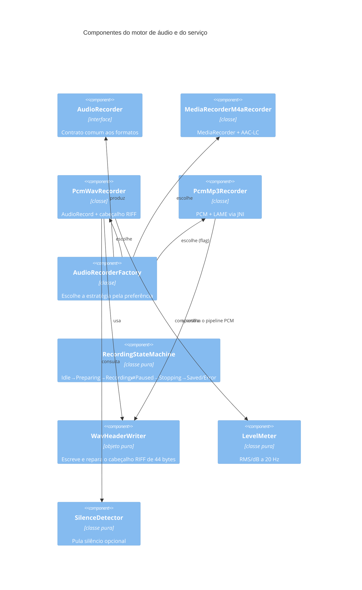

# C4 — Nível 3: Componente

```mermaid
C4Component
    title Componentes do motor de áudio e do serviço

    Component(recorder, "AudioRecorder", "interface", "Contrato comum aos formatos")
    Component(m4a, "MediaRecorderM4aRecorder", "classe", "MediaRecorder + AAC-LC")
    Component(wav, "PcmWavRecorder", "classe", "AudioRecord + cabeçalho RIFF")
    Component(mp3, "PcmMp3Recorder", "classe", "PCM + LAME via JNI")
    Component(factory, "AudioRecorderFactory", "classe", "Escolhe a estratégia pela preferência")
    Component(fsm, "RecordingStateMachine", "classe pura", "Idle→Preparing→Recording⇄Paused→Stopping→Saved/Error")
    Component(riff, "WavHeaderWriter", "objeto puro", "Escreve e repara o cabeçalho RIFF de 44 bytes")
    Component(vu, "LevelMeter", "classe pura", "RMS/dB a 20 Hz")
    Component(silence, "SilenceDetector", "classe pura", "Pula silêncio opcional")

    Rel(factory, recorder, "produz")
    Rel(factory, m4a, "escolhe")
    Rel(factory, wav, "escolhe")
    Rel(factory, mp3, "escolhe (flag)")
    Rel(wav, riff, "usa")
    Rel(mp3, riff, "compartilha o pipeline PCM")
    Rel(wav, vu, "amostra")
    Rel(wav, silence, "consulta")
```

## Regra de dependência

`:feature → :core:domain ← :core:data / :core:audio-engine / :core:audio-android`.
O domínio não importa Android.
