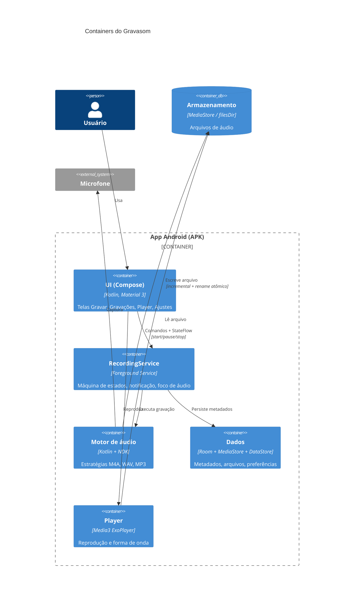

# C4 — Nível 2: Container

```mermaid
C4Container
    title Containers do Gravasom
    Person(usuario, "Usuário")

    Container_Boundary(app, "App Android (APK)") {
        Container(ui, "UI (Compose)", "Kotlin, Material 3", "Telas Gravar, Gravações, Player, Ajustes")
        Container(svc, "RecordingService", "Foreground Service", "Máquina de estados, notificação, foco de áudio")
        Container(audio, "Motor de áudio", "Kotlin + NDK", "Estratégias M4A, WAV, MP3")
        Container(data, "Dados", "Room + MediaStore + DataStore", "Metadados, arquivos, preferências")
        Container(play, "Player", "Media3 ExoPlayer", "Reprodução e forma de onda")
    }
    ContainerDb(files, "Armazenamento", "MediaStore / filesDir", "Arquivos de áudio")
    System_Ext(mic, "Microfone")

    Rel(usuario, ui, "Usa")
    Rel(ui, svc, "Comandos + StateFlow", "start/pause/stop")
    Rel(svc, audio, "Executa gravação")
    Rel(audio, files, "Escreve arquivo", "incremental + rename atômico")
    Rel(svc, data, "Persiste metadados")
    Rel(ui, play, "Reproduz")
    Rel(play, files, "Lê arquivo")
    Rel(audio, mic, "Captura")
```
