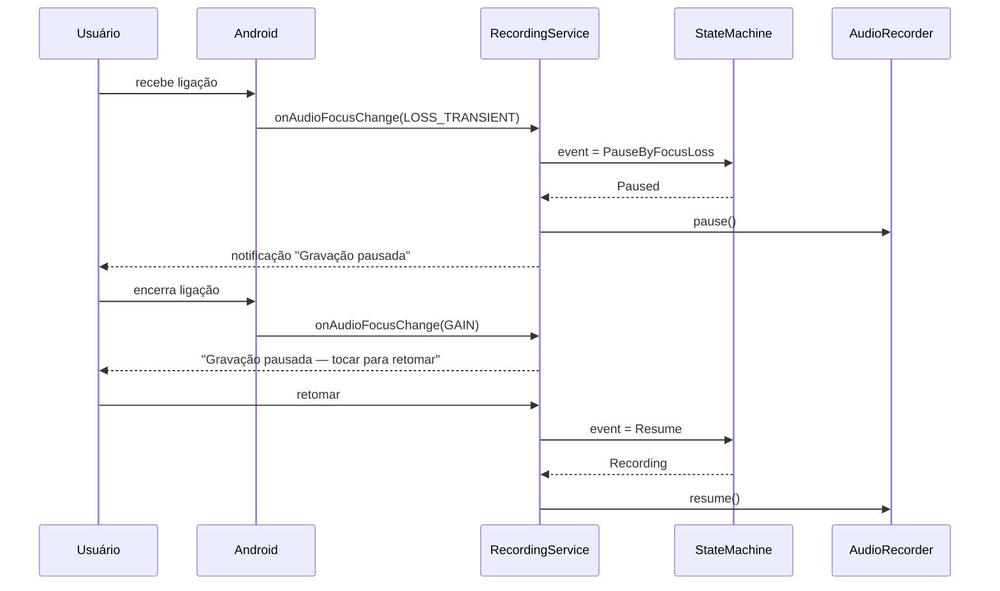
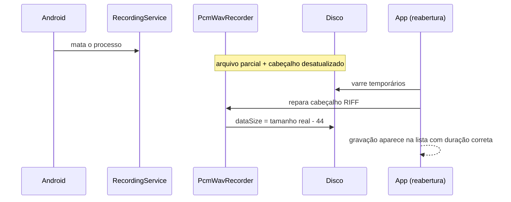

# Diagramas de sequência — cenários de interrupção

## Ligação recebida durante a gravação

```mermaid
sequenceDiagram
    participant U as Usuário
    participant OS as Android
    participant S as RecordingService
    participant FSM as StateMachine
    participant R as AudioRecorder
    U->>OS: recebe ligação
    OS->>S: onAudioFocusChange(LOSS_TRANSIENT)
    S->>FSM: event = PauseByFocusLoss
    FSM-->>S: Paused
    S->>R: pause()
    S-->>U: notificação "Gravação pausada"
    U->>OS: encerra ligação
    OS->>S: onAudioFocusChange(GAIN)
    S-->>U: "Gravação pausada — tocar para retomar"
    U->>S: retomar
    S->>FSM: event = Resume
    FSM-->>S: Recording
    S->>R: resume()
```

## Processo encerrado pelo sistema (WAV)

```mermaid
sequenceDiagram
    participant OS as Android
    participant S as RecordingService
    participant R as PcmWavRecorder
    participant D as Disco
    participant App as App (reabertura)
    OS->>S: mata o processo
    Note over R,D: arquivo parcial + cabeçalho desatualizado
    App->>D: varre temporários
    App->>R: repara cabeçalho RIFF
    R->>D: dataSize = tamanho real - 44
    App-->>App: gravação aparece na lista com duração correta
```
